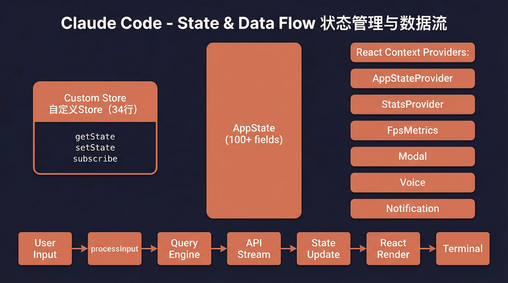

# Claude Code

<p align="right"><strong>中文</strong> | <a href="./README.en.md">English</a></p>

基于 Claude Code 泄露源码修复的**本地可运行版本**，支持两类后端：

- **Anthropic Messages API**（默认）：如官方 API、MiniMax Anthropic 端点等；
- **OpenAI Chat Completions**（可选）：如 one-api、部分仅提供 `/v1/chat/completions` 的聚合网关（需设置 `CLAUDE_CODE_USE_OPENAI_COMPAT_API`，详见下文与 [OpenAI 兼容说明](./docs/OpenAI兼容API接入方案.md)）。

> 原始泄露源码无法直接运行。本仓库修复了启动链路中的多个阻塞问题，使完整的 Ink TUI 交互界面可以在本地工作。

<p align="center">
  
</p>

## 功能

- 完整的 Ink TUI 交互界面（与官方 Claude Code 一致）
- `--print` 无头模式（脚本/CI 场景）
- 支持 MCP 服务器、插件、Skills
- 支持自定义 API 端点和模型
- **OpenAI 格式兼容**（`CLAUDE_CODE_USE_OPENAI_COMPAT_API`）：流式 + 非流式兜底、Recovery CLI 等同路径
- 降级 Recovery CLI 模式

---

## 架构概览

<table>
  <tr>
    <td align="center" width="25%"><br><b>整体架构</b></td>
    <td align="center" width="25%"><br><b>请求生命周期</b></td>
    <td align="center" width="25%"><br><b>工具系统</b></td>
    <td align="center" width="25%"><br><b>多 Agent 架构</b></td>
  </tr>
  <tr>
    <td align="center" width="25%"><br><b>终端 UI</b></td>
    <td align="center" width="25%"><br><b>权限与安全</b></td>
    <td align="center" width="25%"><br><b>服务层</b></td>
    <td align="center" width="25%"><br><b>状态与数据流</b></td>
  </tr>
</table>

---

## 快速开始

### 1. 安装 Bun

本项目运行依赖 [Bun](https://bun.sh)。如果你的电脑还没有安装 Bun，可以先执行下面任一方式：

```bash
# macOS / Linux（官方安装脚本）
curl -fsSL https://bun.sh/install | bash
```

如果在精简版 Linux 环境里提示 `unzip is required to install bun`，先安装 `unzip`：

```bash
# Ubuntu / Debian
apt update && apt install -y unzip
```

```bash
# macOS（Homebrew）
brew install bun
```

```powershell
# Windows（PowerShell）
powershell -c "irm bun.sh/install.ps1 | iex"
```

安装完成后，重新打开终端并确认：

```bash
bun --version
```

### 2. 安装项目依赖

```bash
bun install
```

### 3. 配置环境变量

复制示例文件并填入你的 API Key：

```bash
cp .env.example .env
```

编辑 `.env`：

```env
# API 认证（二选一）
ANTHROPIC_API_KEY=sk-xxx          # 标准 API Key（x-api-key 头）
ANTHROPIC_AUTH_TOKEN=sk-xxx       # Bearer Token（Authorization 头）

# API 端点（可选，默认 Anthropic 官方）
ANTHROPIC_BASE_URL=https://api.minimaxi.com/anthropic

# 模型配置
ANTHROPIC_MODEL=MiniMax-M2.7-highspeed
ANTHROPIC_DEFAULT_SONNET_MODEL=MiniMax-M2.7-highspeed
ANTHROPIC_DEFAULT_HAIKU_MODEL=MiniMax-M2.7-highspeed
ANTHROPIC_DEFAULT_OPUS_MODEL=MiniMax-M2.7-highspeed

# 超时（毫秒）
API_TIMEOUT_MS=3000000

# 禁用遥测和非必要网络请求
DISABLE_TELEMETRY=1
CLAUDE_CODE_DISABLE_NONESSENTIAL_TRAFFIC=1
```

若网关为 **OpenAI Chat Completions**（而非 Anthropic `/v1/messages`），在 `.env` 中开启兼容并指向你的网关（勿在 URL 上加引号）：

```env
CLAUDE_CODE_USE_OPENAI_COMPAT_API=true
ANTHROPIC_AUTH_TOKEN=你的令牌
ANTHROPIC_BASE_URL=https://your-one-api.example/v1
ANTHROPIC_MODEL=你在后台配置的模型名
```

更多变量（如 `CLAUDE_CODE_OPENAI_EXTRA_BODY`、与「仅修正 URL 的 Anthropic 模式」之区别）见 **`.env.example`** 与 **[docs/OpenAI兼容API接入方案.md](./docs/OpenAI兼容API接入方案.md)**。

### 4. 启动

#### macOS / Linux

```bash
# 交互 TUI 模式（完整界面）
./bin/claudecode

# 无头模式（单次问答）
./bin/claudecode -p "your prompt here"

# 管道输入
echo "explain this code" | ./bin/claudecode -p

# 查看所有选项
./bin/claudecode --help
```

#### Windows

> **前置要求**：必须安装 [Git for Windows](https://git-scm.com/download/win)（提供 Git Bash，项目内部 Shell 执行依赖它）。

Windows 下启动脚本 `bin/claudecode` 是 bash 脚本，无法在 cmd / PowerShell 中直接运行。请使用以下方式：

**方式一：PowerShell / cmd 直接调用 Bun（推荐）**

```powershell
# 交互 TUI 模式
bun --env-file=.env ./src/entrypoints/cli.tsx

# 无头模式
bun --env-file=.env ./src/entrypoints/cli.tsx -p "your prompt here"

# 降级 Recovery CLI
bun --env-file=.env ./src/localRecoveryCli.ts
```

**方式二：Git Bash 中运行**

```bash
# 在 Git Bash 终端中，与 macOS/Linux 用法一致
./bin/claudecode
```

> **注意**：部分功能（语音输入、Computer Use、Sandbox 隔离等）在 Windows 上不可用，不影响核心 TUI 交互。

### 5. 编译为独立可执行文件（可选）

本项目依赖 **Bun 运行时**（含 `bun:*` 等 API），不能像纯 Node 项目那样直接用 `pkg` 等打成 Node 单文件；应使用 Bun 的 **`bun build --compile`**，把应用与一份 Bun 运行时打进**单个可执行文件**。

> **说明**：命令行 `bun build --help` 里对 `--target` 的简述（`browser` / `bun` / `node`）主要针对**普通打包**；在 **`--compile` 独立可执行文件**场景下，官方还支持 **`bun-<os>-<arch>`** 形式的交叉编译目标，以下以 [Standalone executables](https://bun.com/docs/bundler/executables) 为准。

**前置**

```bash
bun install
```

下文统一以 **完整 TUI 主入口** `./src/entrypoints/cli.tsx` 为例；输出文件名可按需修改。

#### 本机构建（不指定 `--target`，产物对应当前机器）

```bash
bun build --compile ./src/entrypoints/cli.tsx --outfile=claudecode
```

- **Linux / macOS**：一般为无扩展名文件，`chmod +x claudecode`。
- **Windows**：建议使用 `--outfile=claudecode.exe`；若省略 `.exe`，Bun 也可能自动补上（见官方文档）。

在本机为 Windows 构建时，可选用 `bun build --help` 中的 **`--windows-hide-console`**、**`--windows-icon`** 等元数据选项。

#### 交叉编译（指定 `--target`）

`--target` 与 `--outfile` 的先后顺序**任意**，只要参数都传给 `bun build` 即可。

**在 Linux / macOS 上产出 Windows x64 可执行文件**

```bash
bun build --compile ./src/entrypoints/cli.tsx --outfile=claudecode.exe --target=bun-windows-x64
```

兼容更老 CPU（无 AVX2 等，若用户遇到 `Illegal instruction` 可改用它）：

```bash
bun build --compile ./src/entrypoints/cli.tsx --outfile=claudecode.exe --target=bun-windows-x64-baseline
```

明确面向较新 CPU、可能更快：

```bash
bun build --compile ./src/entrypoints/cli.tsx --outfile=claudecode.exe --target=bun-windows-x64-modern
```

**在 Windows / macOS 上产出 Linux x64（glibc，常见服务器）**

```bash
bun build --compile ./src/entrypoints/cli.tsx --outfile=claudecode --target=bun-linux-x64
```

```bash
bun build --compile ./src/entrypoints/cli.tsx --outfile=claudecode --target=bun-linux-x64-baseline
```

```bash
bun build --compile ./src/entrypoints/cli.tsx --outfile=claudecode --target=bun-linux-x64-modern
```

**Alpine 等 musl 环境（Linux x64 / arm64）**

```bash
bun build --compile ./src/entrypoints/cli.tsx --outfile=claudecode --target=bun-linux-x64-musl
bun build --compile ./src/entrypoints/cli.tsx --outfile=claudecode --target=bun-linux-arm64-musl
```

**Linux ARM64（如部分云主机、树莓派等）**

```bash
bun build --compile ./src/entrypoints/cli.tsx --outfile=claudecode --target=bun-linux-arm64
```

**Windows ARM64**

```bash
bun build --compile ./src/entrypoints/cli.tsx --outfile=claudecode.exe --target=bun-windows-arm64
```

**macOS（Apple Silicon / Intel）**

```bash
bun build --compile ./src/entrypoints/cli.tsx --outfile=claudecode --target=bun-darwin-arm64
bun build --compile ./src/entrypoints/cli.tsx --outfile=claudecode --target=bun-darwin-x64
```

（`bun-darwin-x64` 同样可选用 `-baseline` / `-modern` 变体，见官方文档。）

#### 官方支持的 `--compile` 目标一览

| `--target` | 系统 | 架构 | Baseline / Modern 变体 | libc |
|------------|------|------|-------------------------|------|
| `bun-linux-x64` | Linux | x64 | 有 | glibc |
| `bun-linux-arm64` | Linux | arm64 | 仅默认 | glibc |
| `bun-linux-x64-musl` | Linux | x64 | 有 | musl |
| `bun-linux-arm64-musl` | Linux | arm64 | 仅默认 | musl |
| `bun-windows-x64` | Windows | x64 | 有 | - |
| `bun-windows-arm64` | Windows | arm64 | 仅默认 | - |
| `bun-darwin-x64` | macOS | x64 | 有 | - |
| `bun-darwin-arm64` | macOS | arm64 | 仅默认 | - |

x64 下的 **`-baseline`**：面向更老 CPU（文档示例为 Nehalem 及以后）；**`-modern`**：明确 2013 年以后 CPU（如 Haswell），可能更快。若目标机报 **`Illegal instruction`**，可换 **baseline** 构建。

#### 使用本机已下载的 Bun 做交叉编译（可选）

若不能自动联网下载目标运行时，可使用：

```bash
bun build --compile ./src/entrypoints/cli.tsx --outfile=claudecode.exe --target=bun-windows-x64 \
  --compile-executable-path=/path/to/windows-bun.exe
```

路径需指向**与 `--target` 一致的平台**的 Bun 可执行文件。

#### 其它注意

- 首次为某个 `--target` 构建时，Bun 通常会**下载**对应平台的运行时，需网络畅通（或使用 `--compile-executable-path`）。
- 官方文档说明：**在非 Windows 上交叉编译 Windows 产物时**，依赖 Windows API 的 **`--windows-icon` 等元数据选项目前不可用**；在本机 Windows 上为 Windows 构建时可用。
- 二进制体积较大；若不需要单文件，可在目标机安装 Bun 后使用 `bun --env-file=.env ./src/entrypoints/cli.tsx`。
- 含 **原生扩展（`.node`）** 时，交叉编译可能失败，需按报错处理或在该平台本机构建。
- **降级 Recovery CLI** 单独入口：`bun build --compile ./src/localRecoveryCli.ts --outfile=claude-recovery`，交叉编译时同样加上对应的 `--target=...` 即可。

更多选项以 **`bun build --help`** 与 **[Standalone executables](https://bun.com/docs/bundler/executables)** 为准。

---

## 从 GitHub Release 一键安装

仓库提供 `install/install.sh`（Linux / macOS）与 `install/install.ps1`（Windows）。使用前需在 GitHub 上创建 **Release**，并上传 `bun run build:release` 产出的 `claudecode-<平台>-<版本>.tar.gz`（脚本从 `releases/latest` 拉取匹配平台的资源）。

- **完整说明**（依赖、自定义目录、`GITHUB_TOKEN`、卸载等）：[install/README.md](./install/README.md)
- **默认仓库**为 `wyt990/claude-code-haha`；安装时可设置环境变量 **`GITHUB_REPO=owner/repo`** 指向你的 fork 或镜像。

**Linux / macOS：**

```bash
curl -fsSL https://raw.githubusercontent.com/wyt990/claude-code-haha/main/install/install.sh | bash

# 安装完成后配置文件默认位置：/root/.local/share/claude-code-local/.env
```

**Windows（PowerShell）：**

```powershell
irm https://raw.githubusercontent.com/wyt990/claude-code-haha/main/install/install.ps1 | iex
```

安装后：**当前工作目录**即你打开的项目目录；**API 等配置**写在安装目录下的 `.env`。启动器会设置 **`CLAUDE_CODE_INSTALL_PREFIX`**，运行时从该目录加载 `.env`（不覆盖你已在 shell 里导出的变量）。解析 GitHub API 需要 **`jq` 或 `python3`**（与 `curl`、`tar` 一并说明见 `install/README.md`）。

**安装目录 `.env` 的命令行维护**：在已设置 `CLAUDE_CODE_INSTALL_PREFIX` 的前提下，可执行 `claudecode --help` 查看 `--env-list`、`--env-set`、`--add-provider` 等与安装前缀 `.env` 相关的子命令。其中 **`--force` 仅作用于上述 env 维护子命令**（用于非交互场景下跳过删除关键键、导出含密钥等确认），**不**改变普通交互/无头会话的其它行为。完整说明见 **`docs/环境变量与模型配置管理方案.md`**。

---

## 环境变量说明

| 变量 | 必填 | 说明 |
|------|------|------|
| `ANTHROPIC_API_KEY` | 二选一 | API Key，通过 `x-api-key` 头发送 |
| `ANTHROPIC_AUTH_TOKEN` | 二选一 | Auth Token，通过 `Authorization: Bearer` 头发送 |
| `ANTHROPIC_BASE_URL` | 否 | 自定义 API 根地址；Anthropic 模式为 Messages 基址，OpenAI 兼容模式用于拼 `/v1/chat/completions` |
| `CLAUDE_CODE_USE_OPENAI_COMPAT_API` | 否 | 设为 `1`/`true` 时走 **OpenAI Chat Completions**，适合 one-api 等 |
| `CLAUDE_CODE_OPENAI_COMPATIBLE_API` | 否 | 仅在使用 **Anthropic SDK** 时自动去掉 `ANTHROPIC_BASE_URL` 末尾 `/v1`，与上一项不同；详见文档 |
| `CLAUDE_CODE_OPENAI_BASE_URL` | 否 | 可选，仅 OpenAI 兼容时单独指定网关（默认同 `ANTHROPIC_BASE_URL`） |
| `CLAUDE_CODE_OPENAI_EXTRA_BODY` | 否 | 可选，合并进 Chat Completions JSON 的扩展字段 |
| `ANTHROPIC_MODEL` | 否 | 默认模型 |
| `ANTHROPIC_DEFAULT_SONNET_MODEL` | 否 | Sonnet 级别模型映射 |
| `ANTHROPIC_DEFAULT_HAIKU_MODEL` | 否 | Haiku 级别模型映射 |
| `ANTHROPIC_DEFAULT_OPUS_MODEL` | 否 | Opus 级别模型映射 |
| `API_TIMEOUT_MS` | 否 | API 请求超时，默认 600000 (10min) |
| `DISABLE_TELEMETRY` | 否 | 设为 `1` 禁用遥测 |
| `CLAUDE_CODE_DISABLE_NONESSENTIAL_TRAFFIC` | 否 | 设为 `1` 禁用非必要网络请求 |
| `CLAUDE_CODE_INSTALL_PREFIX` | 否 | 由 `install/install.sh` 等启动器设置；从该目录加载 `.env`（Release 独立可执行文件安装场景） |

---

## 降级模式

如果完整 TUI 出现问题，可以使用简化版 readline 交互模式：

```bash
CLAUDE_CODE_FORCE_RECOVERY_CLI=1 ./bin/claudecode
```

---

## 相对于原始泄露源码的修复

泄露的源码无法直接运行，主要修复了以下问题：

| 问题 | 根因 | 修复 |
|------|------|------|
| TUI 不启动 | 入口脚本把无参数启动路由到了 recovery CLI | 恢复走 `cli.tsx` 完整入口 |
| 启动卡死 | `verify` skill 导入缺失的 `.md` 文件，Bun text loader 无限挂起 | 创建 stub `.md` 文件 |
| `--print` 卡死 | `filePersistence/types.ts` 缺失 | 创建类型桩文件 |
| `--print` 卡死 | `ultraplan/prompt.txt` 缺失 | 创建资源桩文件 |
| **Enter 键无响应** | `modifiers-napi` native 包缺失，`isModifierPressed()` 抛异常导致 `handleEnter` 中断，`onSubmit` 永远不执行 | 加 try-catch 容错 |
| setup 被跳过 | `preload.ts` 自动设置 `LOCAL_RECOVERY=1` 跳过全部初始化 | 移除默认设置 |

---

## 项目结构

```
bin/claudecode          # 入口脚本
preload.ts               # Bun preload（设置 MACRO 全局变量）
install/                 # Release 一键安装脚本（install.sh / install.ps1）与说明
.env.example             # 环境变量模板
docs/                    # 说明文档（含 OpenAI 兼容方案等）
src/
├── entrypoints/cli.tsx  # CLI 主入口
├── main.tsx             # TUI 主逻辑（Commander.js + React/Ink）
├── localRecoveryCli.ts  # 降级 Recovery CLI
├── setup.ts             # 启动初始化
├── screens/REPL.tsx     # 交互 REPL 界面
├── ink/                 # Ink 终端渲染引擎
├── components/          # UI 组件
├── tools/               # Agent 工具（Bash, Edit, Grep 等）
├── commands/            # 斜杠命令（/commit, /review 等）
├── skills/              # Skill 系统
├── services/            # 服务层（API, MCP, OAuth 等；含 openaiCompat/）
├── hooks/               # React hooks
└── utils/               # 工具函数
```

---

## 技术栈

| 类别 | 技术 |
|------|------|
| 运行时 | [Bun](https://bun.sh) |
| 语言 | TypeScript |
| 终端 UI | React + [Ink](https://github.com/vadimdemedes/ink) |
| CLI 解析 | Commander.js |
| API | Anthropic SDK（默认）+ 可选 OpenAI Chat Completions 适配（`src/services/api/openaiCompat/`） |
| 协议 | MCP, LSP |

---

## Disclaimer

本仓库基于 2026-03-31 从 Anthropic npm registry 泄露的 Claude Code 源码。所有原始源码版权归 [Anthropic](https://www.anthropic.com) 所有。仅供学习和研究用途。

# 错误检查

```bash
bun run tsc --noEmit
```